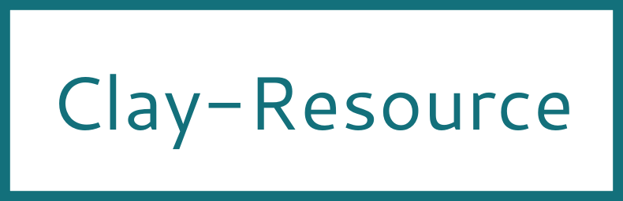

 


<!---
This file is generated by ape-tmpl. Do not update manually.
--->

<!-- Badge Start -->
<a name="badges"></a>

[![Build Status][bd_travis_shield_url]][bd_travis_url]
[![npm Version][bd_npm_shield_url]][bd_npm_url]
[![JS Standard][bd_standard_shield_url]][bd_standard_url]

[bd_repo_url]: https://github.com/realglobe-Inc/clay-resource
[bd_travis_url]: http://travis-ci.org/realglobe-Inc/clay-resource
[bd_travis_shield_url]: http://img.shields.io/travis/realglobe-Inc/clay-resource.svg?style=flat
[bd_travis_com_url]: http://travis-ci.com/realglobe-Inc/clay-resource
[bd_travis_com_shield_url]: https://api.travis-ci.com/realglobe-Inc/clay-resource.svg?token=
[bd_license_url]: https://github.com/realglobe-Inc/clay-resource/blob/master/LICENSE
[bd_codeclimate_url]: http://codeclimate.com/github/realglobe-Inc/clay-resource
[bd_codeclimate_shield_url]: http://img.shields.io/codeclimate/github/realglobe-Inc/clay-resource.svg?style=flat
[bd_codeclimate_coverage_shield_url]: http://img.shields.io/codeclimate/coverage/github/realglobe-Inc/clay-resource.svg?style=flat
[bd_gemnasium_url]: https://gemnasium.com/realglobe-Inc/clay-resource
[bd_gemnasium_shield_url]: https://gemnasium.com/realglobe-Inc/clay-resource.svg
[bd_npm_url]: http://www.npmjs.org/package/clay-resource
[bd_npm_shield_url]: http://img.shields.io/npm/v/clay-resource.svg?style=flat
[bd_standard_url]: http://standardjs.com/
[bd_standard_shield_url]: https://img.shields.io/badge/code%20style-standard-brightgreen.svg

<!-- Badge End -->


<!-- Description Start -->
<a name="description"></a>

Resource accessor for ClayDB

<!-- Description End -->


<!-- Overview Start -->
<a name="overview"></a>


<!-- Overview End -->


<!-- Sections Start -->
<a name="sections"></a>

<!-- Section from "doc/guides/00.TOC.md.hbs" Start -->

<a name="section-doc-guides-00-t-o-c-md"></a>

Table of Contents
----------------

- [Installation](#installation)
- [Usage](#usage)
- [Advanced Usage](#advanced-usage)
  * [Listening to Events](#listening-to-events)
  * [Decorating Resource Method](#decorating-resource-method)
  * [Define Custom Resource class](#define-custom-resource-class)
- [API Guide](#api-guide)
- [License](#license)
- [Links](#links)


<!-- Section from "doc/guides/00.TOC.md.hbs" End -->

<!-- Section from "doc/guides/01.Installation.md.hbs" Start -->

<a name="section-doc-guides-01-installation-md"></a>

Installation
-----

```bash
$ npm install clay-resource --save
```


<!-- Section from "doc/guides/01.Installation.md.hbs" End -->

<!-- Section from "doc/guides/02.Usage.md.hbs" Start -->

<a name="section-doc-guides-02-usage-md"></a>

Usage
---------

```javascript
'use strict'

const {fromDriver} = require('clay-resource')
const clayDriverMemory = require('clay-driver-memory')

async function tryExample () {
  const driver = clayDriverMemory()
  const Product = fromDriver(driver, 'Product')

  {
    const product01 = await Product.create({name: 'Awesome Box', price: 100})
    const {id} = product01
    await Product.update(id, {price: 200})

    const {meta, entities} = await Product.list({
      filter: {price: {$gt: 100}}, // Supported operators: "$gt", "$gte", "$lt", "$lte", "$like", "$in" ...etc
      page: {size: 25, number: 1}
    })
    console.log('Found products:', entities, 'total:', meta.total)
    await Product.destroy(id)
  }
}

tryExample()

```


<!-- Section from "doc/guides/02.Usage.md.hbs" End -->

<!-- Section from "doc/guides/03.Advanced Usage.md.hbs" Start -->

<a name="section-doc-guides-03-advanced-usage-md"></a>

Advanced Usage
---------

### Listening to Events

Resources are instances of [EventEmitter](https://nodejs.org/api/events.html) and fires events.
See [ResourceEvents](https://github.com/realglobe-Inc/clay-constants#ResourceEvents) to know what you can listen.

```javascript
'use strict'

const { fromDriver, ResourceEvents } = require('clay-resource')
const clayDriverMemory = require('clay-driver-memory')

// Events fired from resource
const {
  ENTITY_CREATE,
  ENTITY_CREATE_BULK,
  ENTITY_UPDATE,
  ENTITY_UPDATE_BULK,
  ENTITY_DESTROY,
  ENTITY_DESTROY_BULK,
  ENTITY_DROP
} = ResourceEvents

async function tryEvents () {
  let driver = clayDriverMemory()
  let Product = fromDriver(driver, 'Product')

  Product.on(ENTITY_CREATE, ({ created }) => { /* ... */ })
  Product.on(ENTITY_CREATE_BULK, ({ created }) => { /* ... */ })
  Product.on(ENTITY_UPDATE, ({ id, updated }) => { /* ... */ })
  Product.on(ENTITY_UPDATE_BULK, ({ ids, updated }) => { /* ... */ })
  Product.on(ENTITY_DESTROY, ({ id, destroyed }) => { /* ... */ })
  Product.on(ENTITY_DESTROY_BULK, ({ ids, destroyed }) => { /* ... */ })
  Product.on(ENTITY_DROP, ({ dropped }) => { /* ... */ })
  {
    let product01 = await Product.create({ name: 'Awesome Box', price: 100 })
    /* ... */
  }
}

tryEvents()

```


### Decorating Resource Method

To add some custom logic before/after resource handling, use `.decorate(methodName, decorator)`.

```javascript
'use strict'

const { fromDriver } = require('clay-resource')
const clayDriverMemory = require('clay-driver-memory')

async function tryDecoration () {
  let driver = clayDriverMemory()
  let Product = fromDriver(driver, 'Product')

  // Decorate resource method
  Product.decorate('create', (create) => async function decoratedCreate (attributes) {
    // Add custom check before create
    {
      let ok = /^[a-zA-Z\d].$/.test(attributes.name)
      if (ok) {
        throw new Error('Invalid name!')
      }
    }
    let created = await create(attributes) // Call the original method

    // Add custom logging after created
    {
      let logMsg = '[product] New entity created:' + created.id
      console.log(logMsg)
    }
    return created
  })

  let created = await Product.create({ name: 'foo' })
  /* ... */
}

tryDecoration()

```


### Define Custom Resource class

To define custom resource,  extends `ClayResource` class and use `.fromDriver()` method to create new instance

```javascript
'use strict'

const {ClayResource} = require('clay-resource')
const clayDriverMemory = require('clay-driver-memory')

// Extends ClayResource class
class UserResource extends ClayResource {
  /* ... */
}

void async function () {
  const driver = clayDriverMemory()
  const userResource = UserResource.fromDriver(driver, 'User')

  const user = await userResource.create({name: 'Taka Okunishi'})
  /* ... */
}()


```


<!-- Section from "doc/guides/03.Advanced Usage.md.hbs" End -->

<!-- Section from "doc/guides/10.API Guide.md.hbs" Start -->

<a name="section-doc-guides-10-a-p-i-guide-md"></a>

API Guide
-----

+ [clay-resource@5.5.19](./doc/api/api.md)
  + [create(args)](./doc/api/api.md#clay-resource-function-create)
  + [fromDriver(driver, nameString, options)](./doc/api/api.md#clay-resource-function-from-driver)
  + [ClayResource](./doc/api/api.md#clay-resource-class)


<!-- Section from "doc/guides/10.API Guide.md.hbs" End -->


<!-- Sections Start -->


<!-- LICENSE Start -->
<a name="license"></a>

License
-------
This software is released under the [Apache-2.0 License](https://github.com/realglobe-Inc/clay-resource/blob/master/LICENSE).

<!-- LICENSE End -->


<!-- Links Start -->
<a name="links"></a>

Links
------

+ [ClayDB][clay_d_b_url]
+ [Realglobe, Inc.][realglobe,_inc__url]

[clay_d_b_url]: https://github.com/realglobe-Inc/claydb
[realglobe,_inc__url]: http://realglobe.jp

<!-- Links End -->
